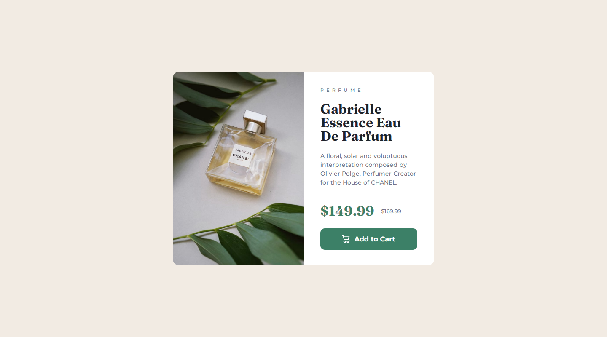

# Frontend Mentor - Product preview card component solution

This is a solution to the [Product preview card component challenge on Frontend Mentor](https://www.frontendmentor.io/challenges/product-preview-card-component-GO7UmttRfa). Frontend Mentor challenges help you improve your coding skills by building realistic projects.

## Table of contents

- [Overview](#overview)
  - [The challenge](#the-challenge)
  - [Screenshot](#screenshot)
  - [Links](#links)
- [My process](#my-process)
  - [Built with](#built-with)
  - [What I learned](#what-i-learned)
  - [Continued development](#continued-development)
  - [Useful resources](#useful-resources)
- [Author](#author)

**Note: Delete this note and update the table of contents based on what sections you keep.**

## Overview

### The challenge

Users should be able to:

- View the optimal layout depending on their device's screen size
- See hover and focus states for interactive elements

### Screenshot



### Links

- Solution URL: [Solution URL](https://github.com/rudimediaz/fem-preview-card)
- Live Site URL: [Site URL](https://rudhifempreviewcard.netlify.app/)

## My process

### Built with

- Semantic HTML5 markup
- CSS custom properties
- Flexbox
- Mobile-first workflow
- Vite - bundler

### What I learned

#### How to handle image as background images, swipe it up for different viewport screens, and give them the correct sizing.

```css
.product-image {
  background-color: var(--primary-dark);
  padding-block: 120px;
  background-image: url(/images/image-product-mobile.jpg);
  background-size: cover;
  background-position-x: center;
}

@media (min-width: 640px) {
  .product-image {
    padding-block: 230px;
    background-image: url(/images/image-product-desktop.jpg);
  }
}
```

Take a look at snippet above. Instead of using _height_ property to determine content height, I use _padding-block_ property because of nature of responsive design.

### Continued development

The perfect judgment of design.

### Useful resources

- [Background images with HTML & CSS
  ](https://www.youtube.com/watch?v=zHZRFwWQt2w&t=840s) - This helped me for introducing css background image
- [Controlling background-images | CSS Tutorial](https://www.youtube.com/watch?v=3T_Jy1CqH9k&t=66s) - This is an advanced tutorial about controlling background images

## Author

- Website - [Rudhi Mediastara (not ready yet!)](#)
- Frontend Mentor - [@rudimediaz](https://www.frontendmentor.io/profile/rudimediaz)
- Twitter - [@rudimediaz](https://www.twitter.com/rudimediaz)
